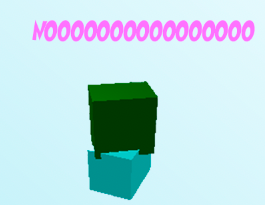
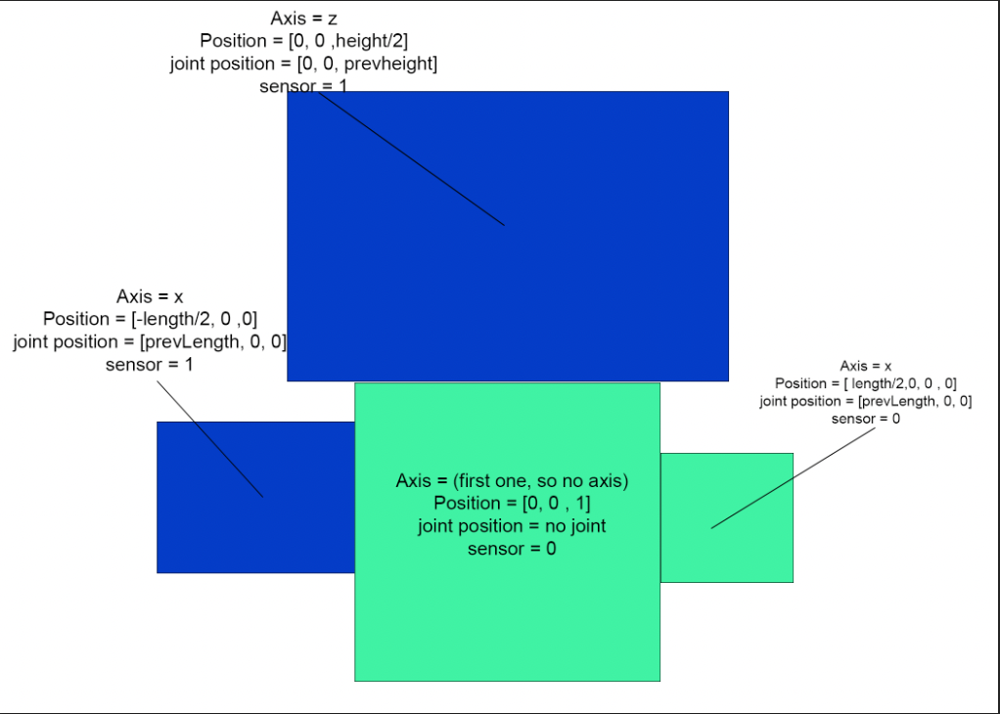
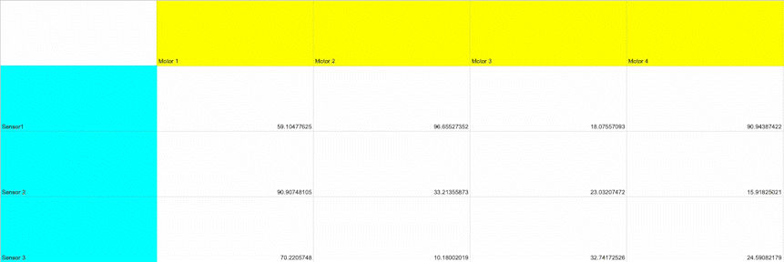
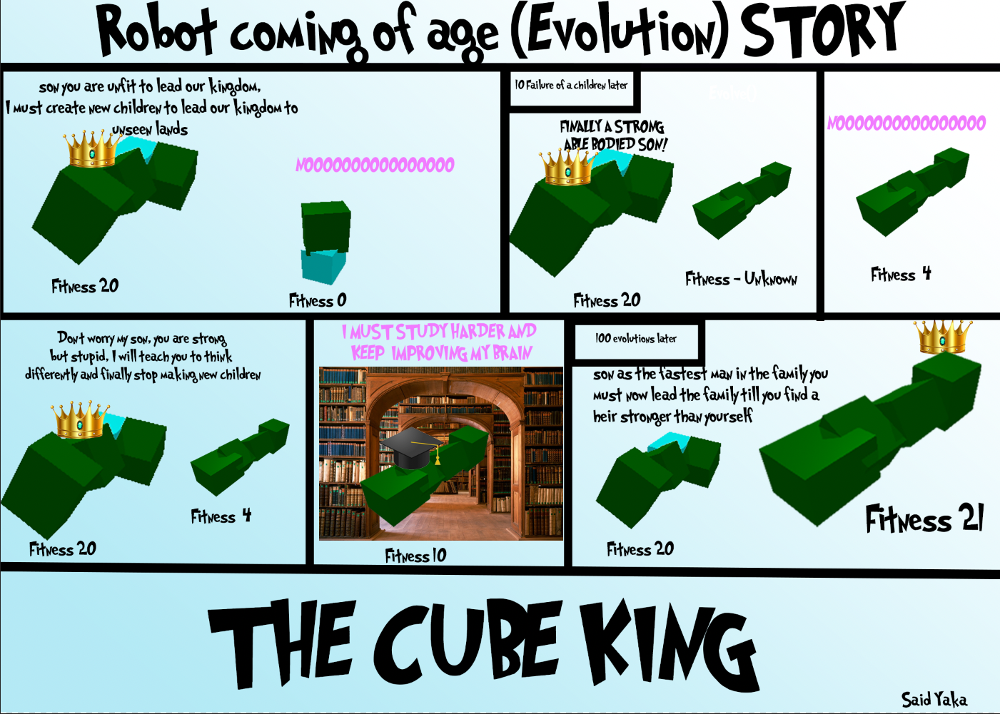
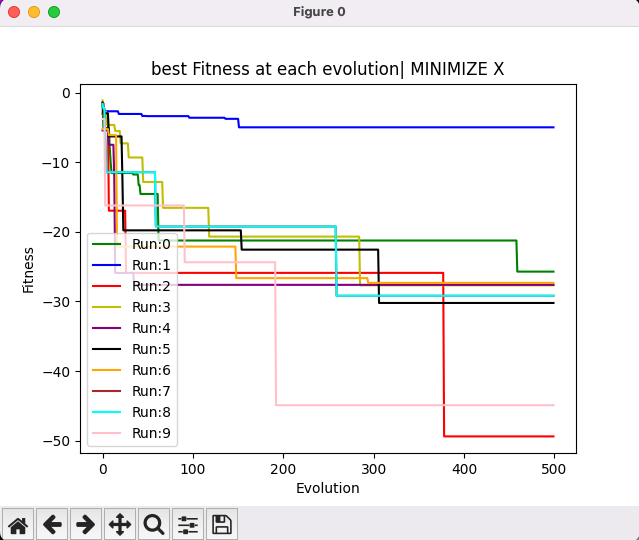

# CS 339 Artificial Life Final Project 

>TLDR/Just want to run?: 
>> if you want to see the first and the best robot run 'python3 main.py show'
>> 
>>if you want to evolve your own robots run (takes 30+ mins 500 generations at 10 parents) 'python3 main.py evolve'
----------------------------------------------------------------------------------------------------------------------------------------------
## GIF

## What does my project do?
Basically we are trying to create a robot that RUNS REALLY FAST! This code creates randomly generated robots that have random movement and bodies, like most completely randomly generated things at first it's AWFUL and barely working, but after big and sometimes small tweaks to both the body and the brain we are able to create robots that RUN REALLY FAST, maybe as fast as Sonic and the Flash! (and maybe even faster if we had more time and a better PC). Now all of this might sound like impossible to do so lets start from the beginning!
## What is Evolution ? 
Evolution is the process by which living things change over time to better survive in their environments. Imagine a group of animals living in the wild, like a herd of deer. Some of the deer might have traits that make them better at running or finding food, like longer legs or a better sense of smell. These traits give those deer an advantage over the others, so they are more likely to survive and have babies with those same helpful traits. Over time, the traits that are helpful become more common in the population, and the animals become better adapted to their environment. This is how evolution works - it's like a long, slow process of trial and error, where the animals that are best suited to their environment are the ones that survive and pass on their traits to the next generation.
## What is the goal of my evolution ? 
My robots try to evolve to try and create robots that get as far from the starting position as possible. Just like many animals who migrate my robots that aren't capable of going far away from the starting point will "die out". The first randomly generated bodies are usually very bad at this but they can improve, and with small improvements over a long period of time we can get very capable robots
## How does body generation work ?
I already talked about "Generating Bodies" but seriously what does that even mean? See in the ludobots library we work with cubes to create virtual robots,if we were to randomize the number of cubes and size of these cubes and put them together and randomly pick if they are a cube with a sensor or not (blue or green) we could create a robot totally randomly. And A lot of the time the first robot we create will just be awful :( like the robot right below with 0 possible movement. and a diagram to better explain body generation after the body generation these bodies go through Parallel hillclimbing to evolve and become a more fit robot.

## How does brain generation work
 When a robot is created we have sensors and we have motors, for each motor our robot is randomly assigned values that tell it to move it at that speed. At first our numbers are totally random creating suboptimal brains, but even with a very optimized brain a terrible body will still be unfit, each neuron will send a signal to the motors that will help them choose the right amount of force to exert and in which order. Here's a quick gif that represents how the weights of the movement, and how they switch (this just a diagram to represent the numbers are not accurate)
 

## Mutation
When a robot is created, it is assigned a random brain, for each evolution we mutate its brain to send different signals at different strengths to find the perfect body/brain combo

Mutating a brain happens by picking random numbers and sending different signals. 

Sources: 
## What is Parallel hillclimbing
in the most simple way possible, Parallel hillclimber evolution is when two groups of animals are trying to climb up two different hills at the same time. Each group is trying to get to the top of their own hill, but they can't see each other or what the other group is doing. As they climb, they get better and better at climbing their own hill, until they both reach the top! Even though they were trying to climb different hills, they both got really good at climbing because they kept practicing and getting better. My goal is to reduce the X position as much as possible in the negative direction

I changed my Parallel hillclimbing to have a few differences, like creating a WHOLE new body when the fitness of the generated robot is > -2 but if it's below -2(for example -4) we create new brains for the robot instead. Heres a comic to better explain it.

Parallel Hillclimbing happens with the childs mutating till it is more fit than its parent, and once that happens the child becomes the parent and a new child is created.
# Results
## Sims
I decided to do the entire 50,000 sims, doing 10 runs with 10 population size of 500 generations, reaching the 50,000 sims. Each run took me about 1 hour and 30 minutes or as I measured it, so the 10 runs took me well over 15 hours with some mistaeks in the runs

## Morphologies
In the first evolutions the robots are usually extremely low fitness or literally at 0 with no ability to move after 100 evolutions but in 
Sources: 

reddit.com/ludobots
https://amandaghassaei.com
https://infoscience.epfl.ch/record/184991
