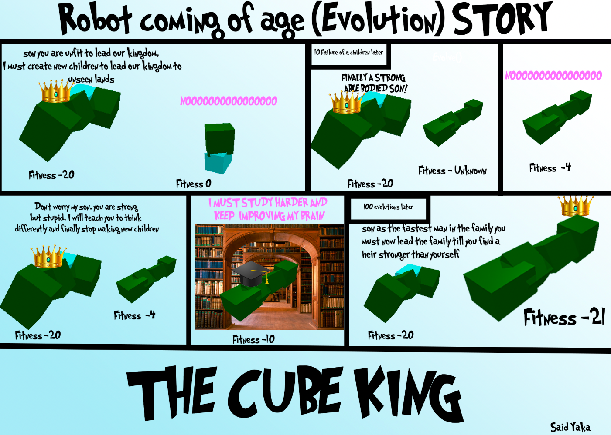

# CS 339 Artificial Life Final Project 

>TLDR/Just want to run?: 
>> if you want to see the first and the best robot run 'python3 main.py show'
>> 
>>if you want to evolve your own robots run (takes 1hour+ 500 generations at 10 parents) 'python3 main.py evolve'
----------------------------------------------------------------------------------------------------------------------------------------------
## GIF

##Video
https://youtu.be/kwDiRrZQTUs

## What does my project do?
Basically we are trying to create a robot that RUNS REALLY FAST! This code creates randomly generated robots that have random movement and bodies, like most completely randomly generated things at first it's AWFUL and barely working, but after big and sometimes small tweaks to both the body and the brain we are able to create robots that RUN REALLY FAST, maybe as fast as Sonic and the Flash! (and maybe even faster if we had more time and a better PC). Now all of this might sound like impossible to do so lets start from the beginning!
## What is Evolution ? 
Evolution is the process by which living things change over time to better survive in their environments. Imagine a group of animals living in the wild, like a herd of deer. Some of the deer might have traits that make them better at running or finding food, like longer legs or a better sense of smell. These traits give those deer an advantage over the others, so they are more likely to survive and have babies with those same helpful traits. Over time, the traits that are helpful become more common in the population, and the animals become better adapted to their environment. This is how evolution works - it's like a long, slow process of trial and error, where the animals that are best suited to their environment are the ones that survive and pass on their traits to the next generation.
## What is the goal of my evolution ? 
My robots try to evolve to try and create robots that get as far from the starting position as possible. Just like many animals who migrate my robots that aren't capable of going far away from the starting point will "die out". The first randomly generated bodies are usually very bad at this but they can improve, and with small improvements over a long period of time we can get very capable robots
## How does body generation work ?
I already talked about "Generating Bodies" but seriously what does that even mean? See in the ludobots library we work with cubes to create virtual robots,if we were to randomize the number of cubes and size of these cubes and put them together and randomly pick if they are a cube with a sensor or not (blue or green) we could create a robot totally randomly. And A lot of the time the first robot we create will just be awful :( like the robot right below with 0 possible movement. and a diagram to better explain body generation after the body generation these bodies go through Parallel hillclimbing to evolve and become a more fit robot.

## How does brain generation work
 When a robot is created we have sensors and we have motors, for each motor our robot is randomly assigned values that tell it to move it at that speed. At first our numbers are totally random creating suboptimal brains, but even with a very optimized brain a terrible body will still be unfit, each neuron will send a signal to the motors that will help them choose the right amount of force to exert and in which order. Here's a quick gif that represents how the weights of the movement, and how they switch (this just a diagram to represent the numbers are not accurate)
 

## Mutation
When a robot is created, it is assigned a random brain, for each evolution we mutate its brain to send different signals at different strengths to find the perfect body/brain combo

Mutating a brain happens by picking random numbers and sending different signals. 

## What is Parallel hillclimbing
in the most simple way possible, Parallel hillclimber evolution is when two groups of animals are trying to climb up two different hills at the same time. Each group is trying to get to the top of their own hill, but they can't see each other or what the other group is doing. As they climb, they get better and better at climbing their own hill, until they both reach the top! Even though they were trying to climb different hills, they both got really good at climbing because they kept practicing and getting better. My goal is to reduce the X position as much as possible in the negative direction

I changed my Parallel hillclimbing to have a few differences, like creating a WHOLE new body when the fitness of the generated robot is > -2 but if it's below -2(for example -4) we create new brains for the robot instead. Heres a comic to better explain it.

Parallel Hillclimbing happens with the childs mutating till it is more fit than its parent, and once that happens the child becomes the parent and a new child is created.

## Pre-Result Hypothesis (3/19)
I hypothesize after a lot of evolution we will end up with something similar to a long dog and I'd assume it to take huge steps like gallops, I think gallops could be created as I have a big range for my motor weights. Here's how I'd guess the movement to look like after evolution

# Results
## Sims
I decided to do the entire 50,000 sims, doing 10 runs with 10 population size of 500 generations, reaching the 50,000 sims. Each run took me about 1 hour and 30 minutes or as I measured it, so the 10 runs took me well over 15 hours with some mistakes in the runs

## Morphologies
In the first evolutions the robots are usually extremely low fitness or literally at 0 with no ability to move after the 500 evolutions, they actually look quite similar, the motor movements are very small and frequent that it almost looks like its gliding across the floor, like an iceskater. The best bots tend to have 3 or 4 limbs, never 1 or 2 that I've seen and they movements are very small enough that we need to zoom into see the motors move. 

## Post Result Analysis and the future (3/19)
After seeing my 10 most evolved bots I was quite shocked to see none of them really looked like a dog, even though I'd have guessed that to be an optimized design, I saw a lot of robots and for the ones with a high fitness function one thing I was able to notice was them having 3-4 limbs only, while I supported limbs upto 6, and previously in my testing upto 12 even though it was way too slow to run and evolve, it would not get very far. I think our evolution does tend to favor simplistic designs, but I think we cannot conclude this as of now because we place limbs randomly and as the number of limbs increase so does the chance of one limb being more of a stopper, I think if I were able to run on a super computer with millions of evolutions I could see designs that support more limb, and since in the higher evolutions we see a "gliding" if I had chance to experiment with higher amount of limbs I could see evolved robots looking similar to centipedes or even hexbug toys

I'd also want to work with ludobots in the future a way where we have to worry about weight and friction.

## How to Run the Code
### Cloning
1. Clone the repository
2. Write 'Git Checkout Final' to switch to the right branch
### Running
> For Running you have 2 options, if you just want to see the first robot and the last robot (most fit robot) simply write
>>'python3 main.py show'

>If you wish to run through an entire evolution yourself write 

>>'python3 main.py evolve'

## Sources: 

reddit.com/ludobots

https://amandaghassaei.com

https://infoscience.epfl.ch/record/184991
